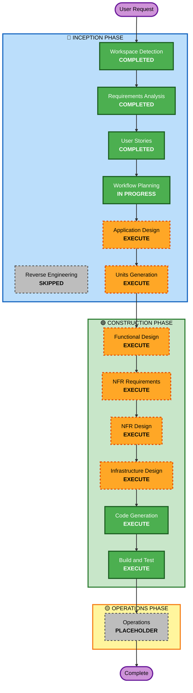

# Execution Plan

## Detailed Analysis Summary

### Project Context
- **Project Type**: Greenfield (신규 개발)
- **System**: 테이블오더 서비스
- **Technology Stack**: Node.js + Express + React + DynamoDB
- **Deployment**: AWS (EC2/ECS, S3, CloudFront)
- **Development Strategy**: Monorepo, 병렬 개발 (고객용/관리자용)

### Change Impact Assessment

**User-facing changes**: Yes
- 고객용 인터페이스: 메뉴 조회, 장바구니, 주문 생성/조회
- 관리자용 인터페이스: 실시간 주문 모니터링, 테이블 관리, 메뉴 관리

**Structural changes**: Yes
- 새로운 시스템 아키텍처 설계 필요
- 프론트엔드 2개 (고객용, 관리자용)
- 백엔드 API 서버
- DynamoDB 데이터 모델

**Data model changes**: Yes
- Store, Table, Menu, Order, OrderHistory 엔티티
- DynamoDB 테이블 설계
- GSI (Global Secondary Index) 설계

**API changes**: Yes
- RESTful API 엔드포인트 설계
- Server-Sent Events (SSE) 엔드포인트
- JWT 인증 API

**NFR impact**: Yes
- 성능: 실시간 주문 업데이트 (2초 이내)
- 보안: JWT 인증, bcrypt 해싱
- 확장성: DynamoDB 자동 확장
- 가용성: 99.5% 목표

### Risk Assessment
- **Risk Level**: Medium
  - 신규 시스템이지만 명확한 요구사항
  - 실시간 통신 (SSE) 구현 복잡도
  - 병렬 개발 팀 간 조율 필요
- **Rollback Complexity**: Easy (신규 시스템이므로 롤백 불필요)
- **Testing Complexity**: Moderate
  - 수동 테스트 전략
  - 실시간 기능 테스트 필요

---

## Workflow Visualization

---

## Phases to Execute

### 🔵 INCEPTION PHASE

- [x] **Workspace Detection** - COMPLETED
  - Greenfield 프로젝트 확인
  - 워크스페이스 루트 설정

- [ ] **Reverse Engineering** - SKIPPED
  - **Rationale**: Greenfield 프로젝트로 기존 코드 없음

- [x] **Requirements Analysis** - COMPLETED
  - 요구사항 문서 생성
  - 기술 스택 및 아키텍처 결정
  - 14개 검증 질문 답변 완료

- [x] **User Stories** - COMPLETED
  - 2개 페르소나 정의 (Customer, Manager)
  - 13개 User Stories 생성
  - INVEST 기준 충족 검증

- [x] **Workflow Planning** - IN PROGRESS
  - 실행 계획 수립 중

- [ ] **Application Design** - EXECUTE
  - **Rationale**: 
    - 새로운 컴포넌트 및 서비스 설계 필요
    - 고객용/관리자용 컴포넌트 구조 정의
    - 서비스 레이어 설계 (인증, 주문, 메뉴, 테이블 관리)
    - 컴포넌트 간 의존성 명확화
    - API 엔드포인트 및 데이터 흐름 정의

- [ ] **Units Generation** - EXECUTE
  - **Rationale**:
    - 복잡한 시스템으로 여러 작업 단위로 분해 필요
    - 병렬 개발 전략 (고객용 팀 / 관리자용 팀)
    - 각 Unit별 독립적인 개발 및 테스트 가능
    - Unit 간 의존성 및 통합 지점 명확화

### 🟢 CONSTRUCTION PHASE

- [ ] **Functional Design** - EXECUTE (per-unit)
  - **Rationale**:
    - 새로운 데이터 모델 설계 (Store, Table, Menu, Order, OrderHistory)
    - 복잡한 비즈니스 로직 (세션 관리, 주문 상태 관리)
    - DynamoDB 스키마 및 GSI 설계
    - 비즈니스 규칙 상세 정의

- [ ] **NFR Requirements** - EXECUTE (per-unit)
  - **Rationale**:
    - 성능 요구사항 (실시간 업데이트 2초 이내)
    - 보안 고려사항 (JWT, bcrypt, HTTPS)
    - 확장성 (DynamoDB 자동 확장, 무상태 백엔드)
    - 기술 스택 선택 검증

- [ ] **NFR Design** - EXECUTE (per-unit)
  - **Rationale**:
    - NFR 패턴 구현 방법 설계
    - JWT 인증 플로우
    - SSE 실시간 통신 구조
    - DynamoDB 쿼리 최적화
    - 에러 처리 및 로깅 전략

- [ ] **Infrastructure Design** - EXECUTE (per-unit)
  - **Rationale**:
    - AWS 인프라 서비스 매핑
    - EC2/ECS 배포 아키텍처
    - DynamoDB 테이블 구성
    - S3 정적 파일 호스팅
    - CloudFront CDN 설정
    - 네트워킹 및 보안 그룹

- [ ] **Code Generation** - EXECUTE (per-unit, ALWAYS)
  - **Rationale**: 실제 코드 구현 필요
  - TDD 선택 옵션 제공

- [ ] **Build and Test** - EXECUTE (ALWAYS)
  - **Rationale**: 빌드, 테스트, 검증 필요
  - 수동 테스트 전략

### 🟡 OPERATIONS PHASE

- [ ] **Operations** - PLACEHOLDER
  - **Rationale**: 향후 배포 및 모니터링 워크플로우 확장 예정

---

## Estimated Timeline

- **Total Phases to Execute**: 11 stages
  - INCEPTION: 2 stages (Application Design, Units Generation)
  - CONSTRUCTION: 6 stages per unit (Functional Design, NFR Requirements, NFR Design, Infrastructure Design, Code Generation, Build and Test)
  
- **Estimated Duration**: 
  - INCEPTION 완료: 2-3 작업일
  - CONSTRUCTION (per unit): 5-7 작업일
  - 총 예상 기간: 프로젝트 규모 및 Unit 수에 따라 결정

---

## Success Criteria

**Primary Goal**: 
- 테이블오더 서비스 MVP 완성
- 고객용 및 관리자용 인터페이스 구현
- 실시간 주문 모니터링 기능 동작

**Key Deliverables**:
- 고객용 React 애플리케이션
- 관리자용 React 애플리케이션
- Node.js + Express 백엔드 API
- DynamoDB 데이터 모델 및 테이블
- OpenAPI/Swagger API 문서
- 빌드 및 테스트 지침서

**Quality Gates**:
- 모든 User Stories의 Acceptance Criteria 충족
- API 엔드포인트 정상 동작
- 실시간 주문 업데이트 2초 이내
- JWT 인증 정상 동작
- 수동 테스트 시나리오 통과

---

## Next Steps

1. **Application Design**: 컴포넌트 및 서비스 레이어 설계
2. **Units Generation**: 작업 단위 분해 및 의존성 정의
3. **Per-Unit Construction**: 각 Unit별 상세 설계 및 코드 생성
4. **Build and Test**: 통합 빌드 및 테스트

---

## 문서 버전 정보
- **작성일**: 2026-02-09
- **버전**: 1.0
- **상태**: 계획 수립 완료
